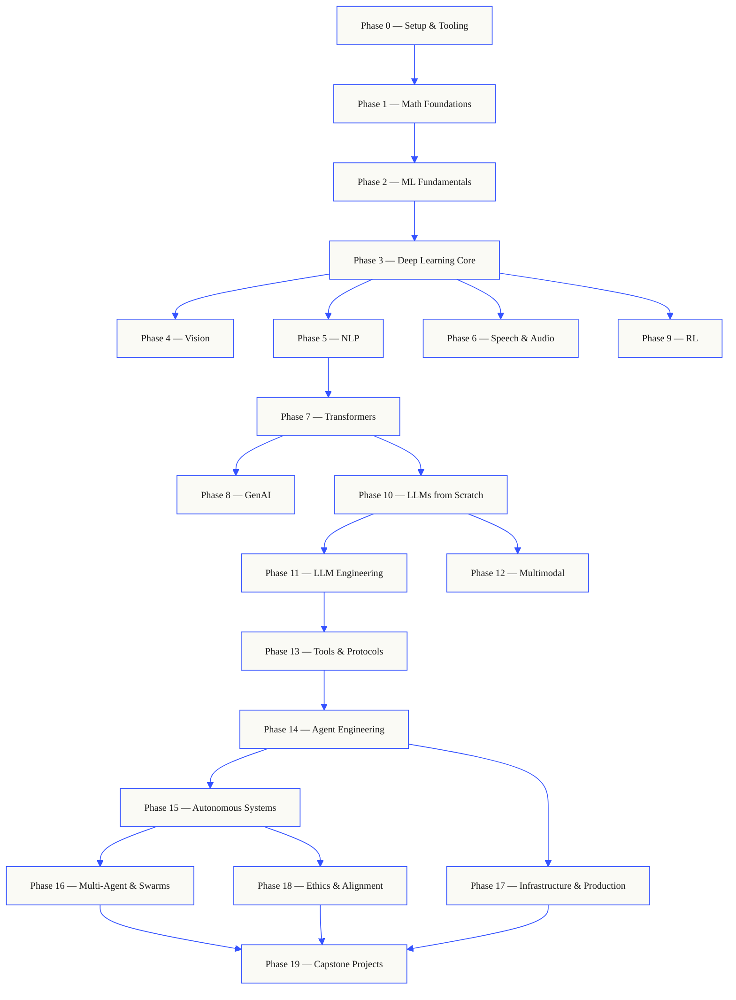
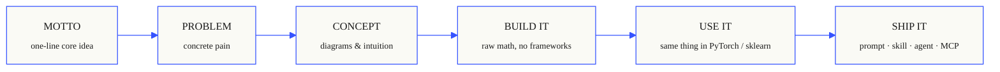

# Visuals — Diagrams

> Source: Mermaid diagrams embedded in repo `README.md`. Phase-level READMEs contain no Mermaid diagrams. Note: ~194 additional Mermaid diagrams live inside per-lesson `docs/en.md` files — out of scope for this README-level extraction per CONTEXT.md Target 11.

> Referenced image `assets/banner.svg` copied to `output/visuals/banner.svg`.

## Diagram 1 · The shape of the curriculum

_Source: `README.md` lines 57–81._

Top-to-bottom flowchart of the full 20-phase dependency graph — how Setup → Math → ML → Deep Learning branches into the Vision / NLP / Speech tracks and converges on LLMs, tools, agents, infrastructure, and capstones.

## Diagram 2 · The shape of a lesson

_Source: `README.md` lines 103–111._

Left-to-right flowchart of the canonical lesson template every lesson follows: MOTTO → PROBLEM → CONCEPT → BUILD IT (raw math) → USE IT (framework) → and onward.

