# Visuals — Mermaid Diagrams

> Extracted from curriculum chapters (05–09, 11–17). No image files exist in this repo — all visuals are Mermaid. Source files scanned: 88.
> Total: 64 diagrams across 32 files.


## `06-retrieval-systems/01-rag-fundamentals.md`  (2 diagrams)

**Context:** 4. GraphRAG (Structured context)

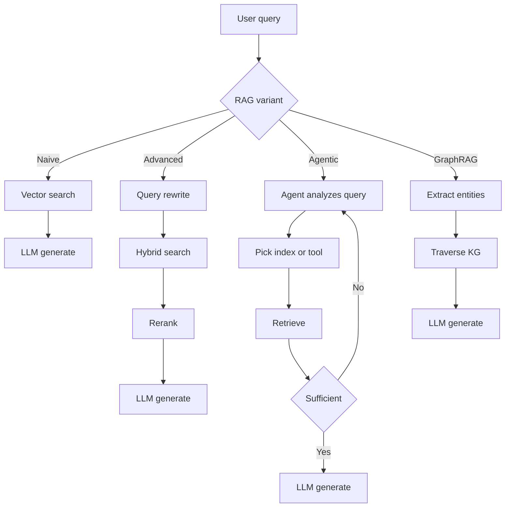

**Context:** RAG vs. 2M Context (The "Hybrid Era")

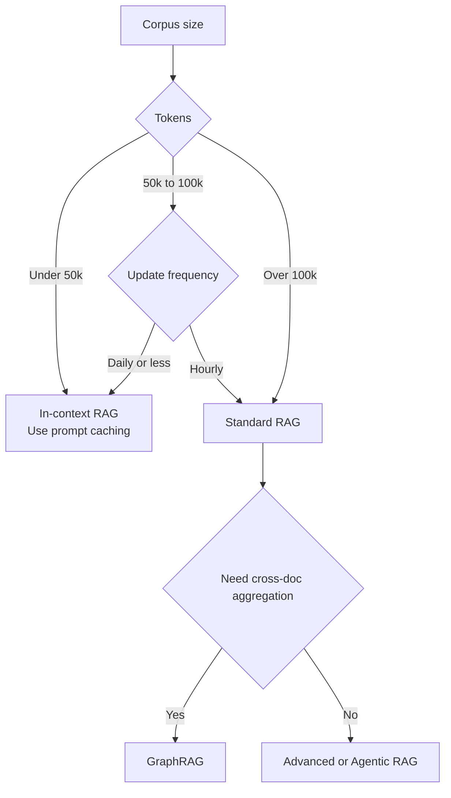

## `06-retrieval-systems/07-graph-rag.md`  (2 diagrams)

**Context:** Decision Flow

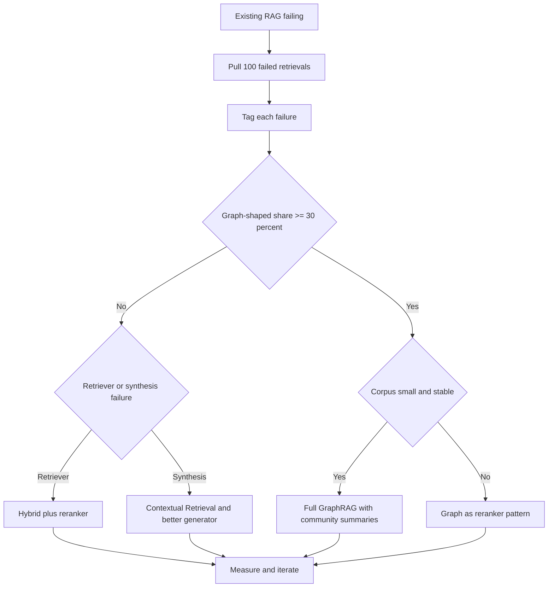

**Context:** Pattern Flow

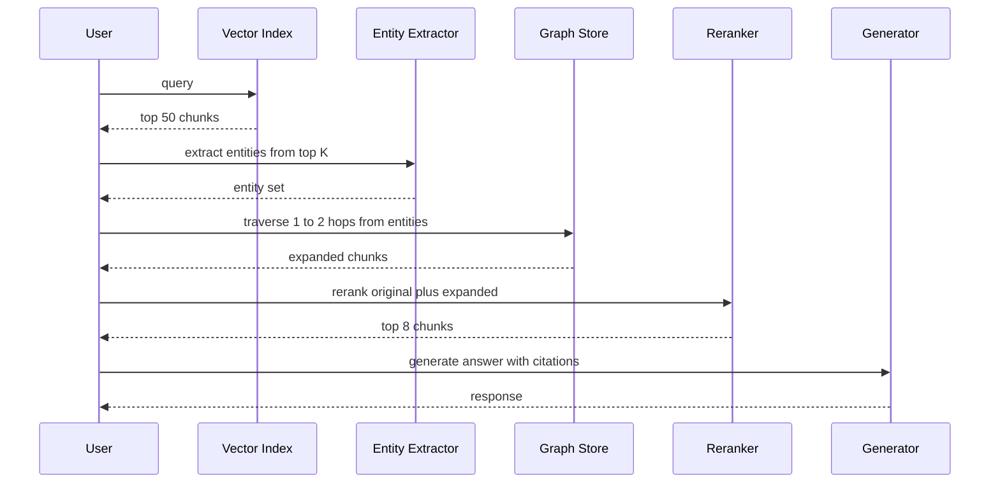

## `07-agentic-systems/02-reasoning-loops-react-and-beyond.md`  (1 diagram)

**Context:** Self-Reflexion Loops

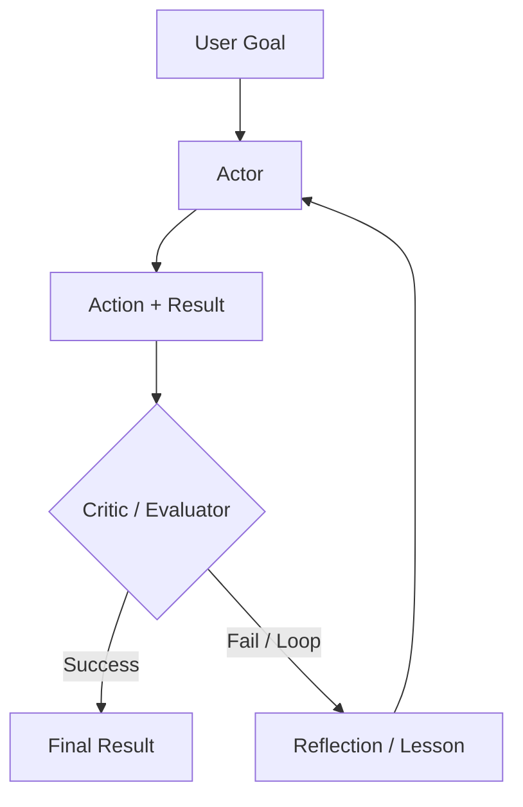

## `07-agentic-systems/03-tool-use-and-mcp.md`  (2 diagrams)

**Context:** Composition Pattern: Support Agent Delegating Refunds

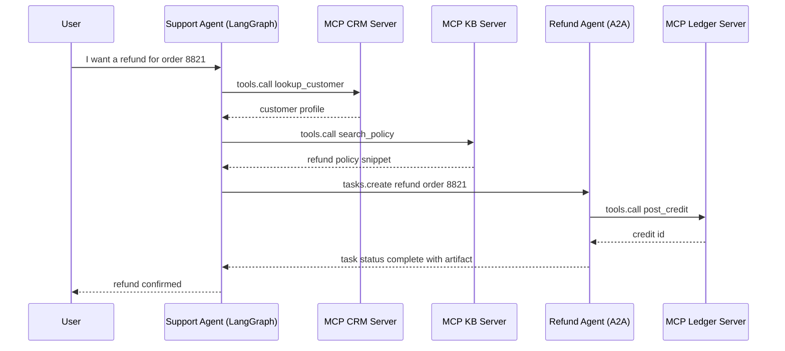

**Context:** MCP Production Hardening (post-May-2026)

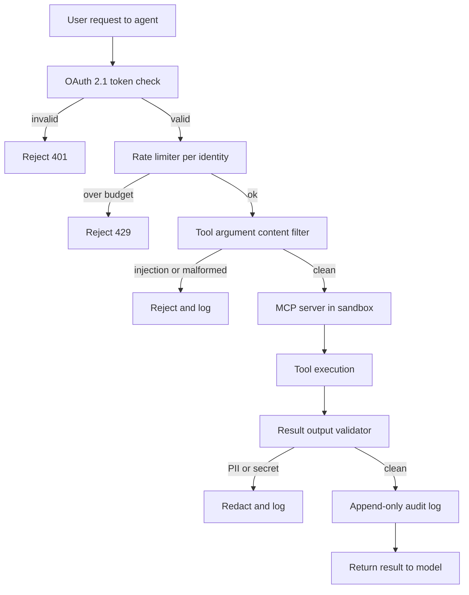

## `07-agentic-systems/README.md`  (2 diagrams)

**Context:** Chapter Order

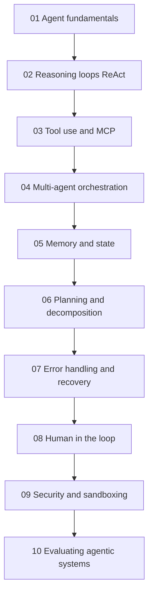

**Context:** Reference Architecture

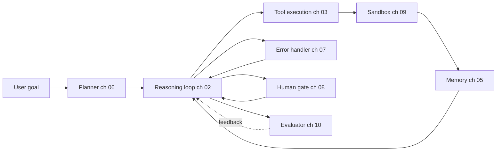

## `09-frameworks-and-tools/01-langchain-deep-dive.md`  (1 diagram)

**Context:** When to Use Just `langchain-core` vs Full LangChain

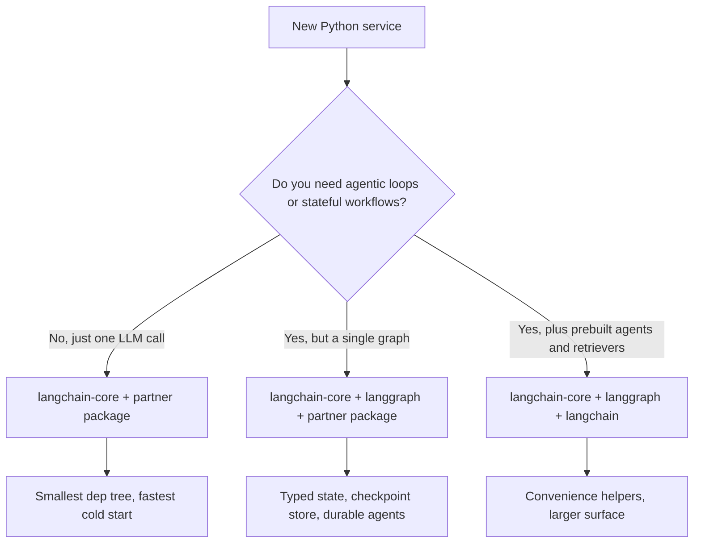

## `09-frameworks-and-tools/04-llamaindex.md`  (1 diagram)

**Context:** Workflows vs LangGraph

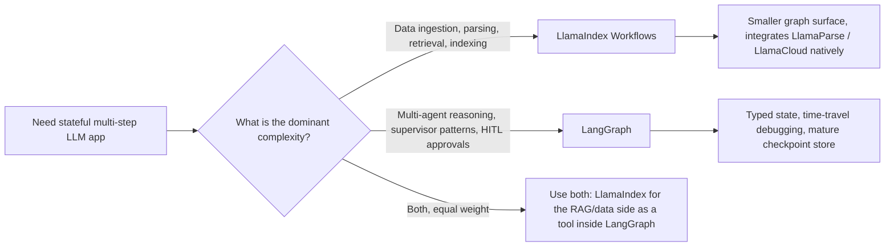

## `09-frameworks-and-tools/11-pydantic-ai-and-mastra.md`  (1 diagram)

**Context:** Comparison with LangGraph

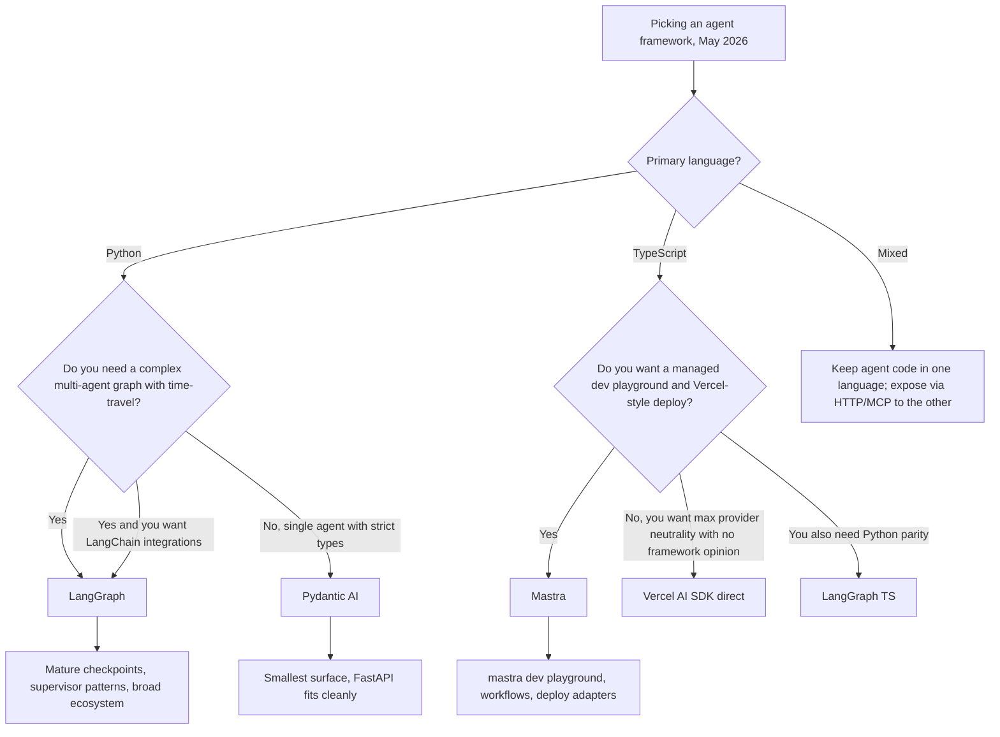

## `11-infrastructure-and-mlops/01-llm-infrastructure.md`  (1 diagram)

**Context:** A Three-Tier Fleet Strategy

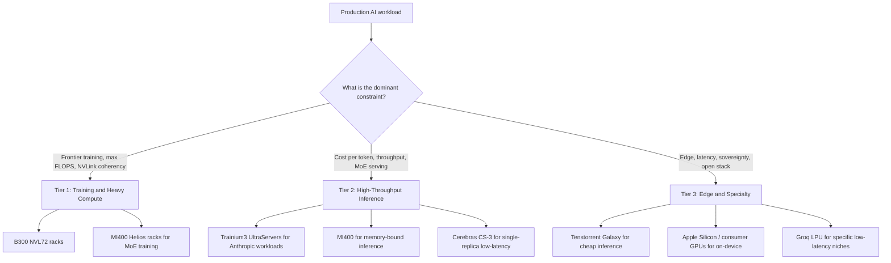

## `12-security-and-access/01-llm-security.md`  (2 diagrams)

**Context:** The Attacker-Defender Loop in Production

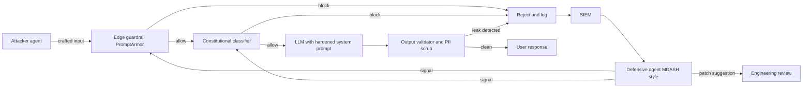

**Context:** Defense Pipeline

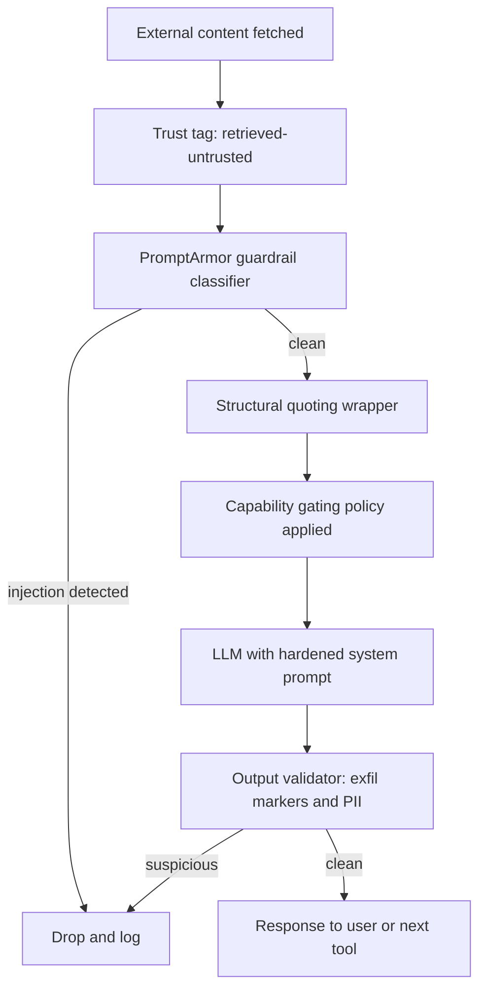

## `14-evaluation-and-observability/01-llm-evaluation.md`  (2 diagrams)

**Context:** The Layered Judge Architecture

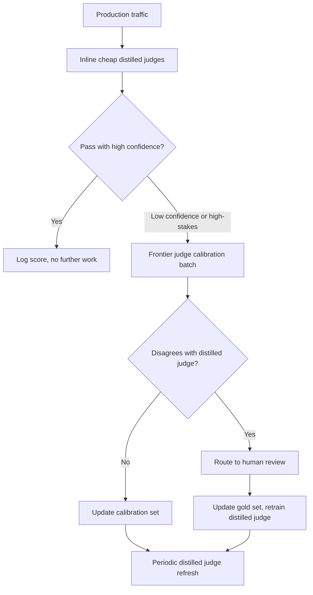

**Context:** A Production Eval Stack in May 2026

```mermaid
flowchart LR
    A[User turn] --> B[Agent runs]
    B --> C[Trajectory logged]
    C --> D[Distilled judges run inline on each tool call and the final answer]
    D --> E[Per-step PRM trajectory score]
    E --> F[Auditor agent on 1-5 percent sample]
    F --> G[Frontier judge on flagged or high-stakes traces]
    G --> H[Human review on disagreements]
    H --> I[Gold set update]
    I --> J[Distilled judge retraining quarterly]
```

## `16-case-studies/01-enterprise-rag.md`  (3 diagrams)

**Context:** High-Level Architecture

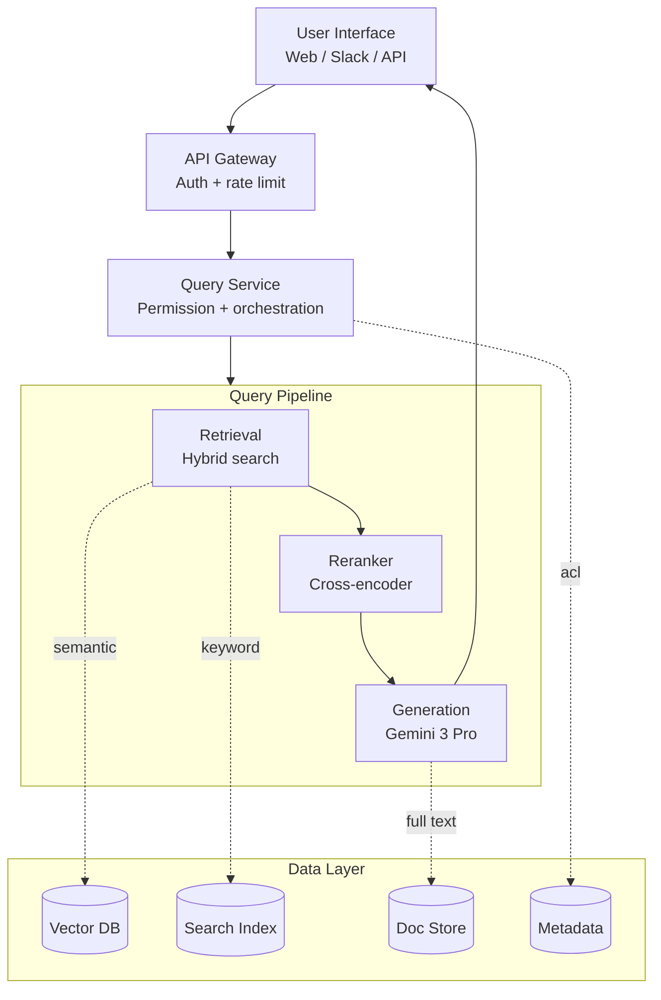

**Context:** Document Ingestion Pipeline

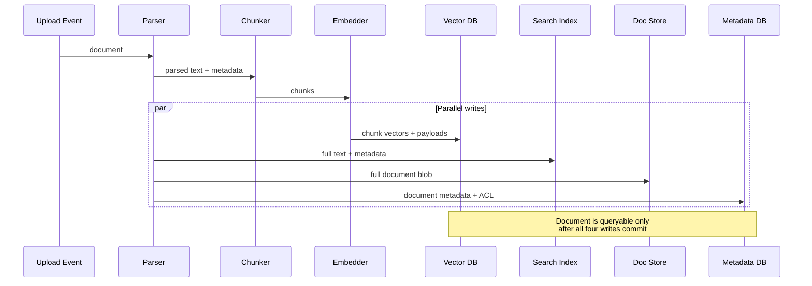

**Context:** Hybrid Retrieval

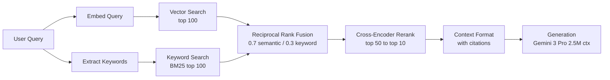

## `16-case-studies/02-conversational-agent.md`  (3 diagrams)

**Context:** High-Level Architecture

```mermaid
flowchart TD
    Client[Web / App Client] --> GW[Gateway<br/>Auth + Tenant]
    GW --> ORCH

    subgraph ORCH[Orchestration Layer]
        IC[Intent Classifier]
        QR[Query Router]
        RG[Response Generator]
        WE[Workflow Engine]
        IC --> QR --> RG --> WE
    end

    QR --> KB[(Knowledge Base<br/>RAG)]
    QR --> AC[(Account Context<br/>Service)]
    QR --> AT[Action Tools<br/>refund, ticket, etc.]

    KB --> RG
    AC --> RG
    AT --> RG
```

**Context:** Conversation Flow

```mermaid
stateDiagram-v2
    [*] --> Classify : user message
    Classify --> Route : intent + entities
    Route --> RAG : knowledge needed
    Route --> Account : account-specific
    Route --> Action : tool call
    RAG --> Generate
    Account --> Generate
    Action --> Generate
    Generate --> Safety : draft response
    Safety --> Confidence : passed
    Safety --> Block : PII or harmful
    Confidence --> Reply : score above threshold
    Confidence --> Escalate : score below threshold
    Reply --> [*]
    Escalate --> [*]
    Block --> [*]
```

**Context:** Confidence-Based Escalation

```mermaid
flowchart TD
    R[Draft Response] --> C1{Confidence<br/>below 0.7}
    R --> C2{Intent =<br/>escalation_request}
    R --> C3{Sensitive<br/>keyword match}
    C1 -->|yes| E[Escalate to Human]
    C2 -->|yes| E
    C3 -->|yes| E
    C1 -->|no| K{All clear}
    C2 -->|no| K
    C3 -->|no| K
    K -->|yes| A[Auto-Reply]
    E --> H[Queue for Human Agent<br/>with context bundle]
```

## `16-case-studies/03-financial-analysis.md`  (3 diagrams)

**Context:** High-Level Pipeline

```mermaid
flowchart LR
    S1[Stage 1: Extraction<br/>Gemini 3 Pro<br/>Self-Consistency k=5] --> S2
    S2[Stage 2: Analysis<br/>Mixture of Agents<br/>Quant + Narrative + Risk] --> S3
    S3[Stage 3: Verification<br/>Multi-Agent Debate<br/>3 models per claim] --> S4
    S4[Stage 4: Final Review<br/>Panel of Judges<br/>Quality score] --> D{Auto-publish<br/>threshold met}
    D -->|yes| P[Publish]
    D -->|no| H[Human Review Queue]
```

**Context:** Data Flow

```mermaid
flowchart TD
    F1[10-K and 10-Q Filings] --> ING[Data Ingestion]
    F2[Earnings Calls] --> ING
    F3[Analyst Reports] --> ING
    ING --> EX[Extraction<br/>k=5 Self-Consistency]
    EX --> SD[(Structured Data<br/>verified metrics)]
    SD --> MOA[MoA Generation<br/>3 specialized agents]
    MOA --> DEB[Debate Verification<br/>flag disagreements]
    DEB --> PAN[Panel Review<br/>quality score]
    PAN --> AP[Auto-Publish<br/>high confidence]
    PAN --> HR[Human Review<br/>low confidence]
```

**Context:** Stage 3: Fact Verification with Multi-Agent Debate

```mermaid
sequenceDiagram
    participant CE as Claim Extractor
    participant D1 as Debater A<br/>Claude 4.5 Opus
    participant D2 as Debater B<br/>GPT-5.2
    participant D3 as Debater C<br/>Gemini 3 Pro
    participant CON as Consensus Logic
    participant OUT as Verification Result

    CE->>CE: extract factual claims<br/>from report
    Note over CE,D3: For each claim, debaters verify independently
    par Independent verification
        CE->>D1: claim + source docs
        D1-->>CON: verdict (supported/inferred/unsupported/contradicted)
    and
        CE->>D2: claim + source docs
        D2-->>CON: verdict
    and
        CE->>D3: claim + source docs
        D3-->>CON: verdict
    end
    CON->>CON: check consensus
    alt all agree supported
        CON->>OUT: verified
    else any contradiction
        CON->>OUT: flagged for human review
    else split verdicts
        CON->>OUT: low confidence
    end
```

## `16-case-studies/04-code-assistant.md`  (3 diagrams)

**Context:** High-Level Architecture

```mermaid
flowchart TD
    IDE[IDE Extension<br/>VS Code / JetBrains]
    IDE --> GW

    subgraph GW[Gateway / Router]
        DB[Debounce]
        AU[Auth]
        FF[Feature Flags]
    end

    GW --> CS[Completion Service<br/>fast: under 200ms]
    GW --> GS[Generation Service<br/>quality: 1-5s]
    GW --> ES[Explanation Service<br/>quality: 1-5s]

    CS --> ML[Model Layer]
    GS --> ML
    ES --> ML
```

**Context:** Context Assembly

```mermaid
flowchart TD
    Start[Cursor event<br/>budget = 4000 tokens]
    Start --> P1[P1: Immediate context<br/>2000 tokens before+after cursor<br/>70/30 split toward before]
    P1 --> R1{Remaining<br/>over 500}
    R1 -->|no| Final[Format context<br/>send to model]
    R1 -->|yes| P2[P2: Related definitions<br/>imports, types, callees<br/>up to 1000 tokens]
    P2 --> R2{Remaining<br/>over 500}
    R2 -->|no| Final
    R2 -->|yes| P3[P3: Other open files<br/>same module / package<br/>fill remaining budget]
    P3 --> Final
```

**Context:** Multi-Stage Verification

```mermaid
flowchart TD
    G[Generated Code] --> SY[Stage 1: Syntax Check<br/>fast, blocking]
    SY -->|fail| RJ[Reject: syntax_error]
    SY -->|ok| SEC[Stage 2: Security Scan<br/>medium, blocking]
    SEC -->|critical| RJV[Reject: vulnerability]
    SEC -->|ok or warnings| TY[Stage 3: Type Check<br/>medium, advisory<br/>typescript / python]
    TY --> TST{Test context<br/>available}
    TST -->|yes| TR[Stage 4: Test Execution<br/>slow, optional]
    TST -->|no| PASS[Present to user<br/>with warnings]
    TR -->|pass| PASS
    TR -->|fail| WARN[Present to user<br/>with test-fail label]
```

## `16-case-studies/05-content-moderation.md`  (2 diagrams)

**Context:** High-Level Architecture

```mermaid
flowchart TD
    IN[Content Ingestion] --> T1{Tier 1: Fast Filters<br/>hash + keyword + pattern<br/>under 10ms, $0.0001}
    T1 -->|blocked: 5%| B1[Block + Report]
    T1 -->|elevated: pattern hit| T2
    T1 -->|pass clean: 85%| T2
    T2{Tier 2: ML Models<br/>vision + text + multimodal<br/>under 100ms, $0.001}
    T2 -->|high confidence: 85% of T2| AA1[Auto Action]
    T2 -->|low confidence: 15% of T2| T3
    T3{Tier 3: LLM Review<br/>nuanced reasoning<br/>under 3s, $0.01}
    T3 -->|confident| AA2[Auto Action]
    T3 -->|uncertain: 2%| HR[Human Review<br/>minutes, $0.50]
```

**Context:** Review Queue Management

```mermaid
stateDiagram-v2
    [*] --> Submitted : new post
    Submitted --> Tier1 : enter pipeline
    Tier1 --> Blocked : hash or keyword hit
    Tier1 --> Tier2 : pass or elevate
    Tier2 --> AutoAction : high confidence
    Tier2 --> Tier3 : low confidence
    Tier3 --> AutoAction : confident
    Tier3 --> CriticalQueue : CSAM or violence
    Tier3 --> HighQueue : hate speech
    Tier3 --> StandardQueue : other violation
    CriticalQueue --> HumanReview : SLO 15 min
    HighQueue --> HumanReview : SLO 1 hr
    StandardQueue --> HumanReview : SLO 24 hr
    HumanReview --> AutoAction : decision logged
    AutoAction --> [*]
    Blocked --> Appealed : user appeals
    AutoAction --> Appealed : user appeals
    Appealed --> AppealQueue
    AppealQueue --> HumanReview : SLO 7 days
```

## `16-case-studies/06-real-time-search.md`  (1 diagram)

**Context:** Solution Architecture

```mermaid
flowchart TB
    subgraph Ingestion["Real-Time Ingestion Layer"]
        NEWS[News Feeds] --> KAFKA[Kafka Stream]
        FILINGS[SEC Filings] --> KAFKA
        SOCIAL[X/Reddit APIs] --> KAFKA
        KAFKA --> PROCESSOR[Stream Processor]
    end

    subgraph Index["Dual-Index Layer"]
        PROCESSOR --> VECTOR_DB[(Vector DB<br/>Qdrant)]
        PROCESSOR --> SEARCH_IDX[(Full-Text<br/>Elasticsearch)]
    end

    subgraph Query["Query Layer"]
        USER[User Query] --> ROUTER{Query Router}
        ROUTER -->|Semantic| VECTOR_DB
        ROUTER -->|Keyword| SEARCH_IDX
        VECTOR_DB --> FUSION[RRF Fusion]
        SEARCH_IDX --> FUSION
    end

    subgraph Generation["Answer Generation"]
        FUSION --> RERANK[Cross-Encoder Rerank]
        RERANK --> LLM[GPT-4o-mini]
        LLM --> RESPONSE[Sourced Answer]
    end
```

## `16-case-studies/07-autonomous-coding-agent.md`  (2 diagrams)

**Context:** Solution Architecture

```mermaid
flowchart LR
    subgraph Planning["Planning Phase"]
        TASK[User Task] --> PLANNER[Planner Agent<br/>Claude Sonnet 4.6]
        PLANNER --> PLAN[Task Plan]
    end

    subgraph Execution["Execution Loop"]
        PLAN --> CODER[Coder Agent<br/>Claude Sonnet 4.6]
        CODER --> SANDBOX[E2B Sandbox]
        SANDBOX --> TESTS{Tests Pass?}
        TESTS -->|No| DEBUGGER[Debugger Agent]
        DEBUGGER --> CODER
        TESTS -->|Yes| DIFF[Generate Diff]
    end

    subgraph Review["Human Review"]
        DIFF --> HITL[Human Approval]
        HITL -->|Approved| PR[Create PR]
        HITL -->|Rejected| FEEDBACK[Feedback]
        FEEDBACK --> CODER
    end
```

**Context:** The Codebase Understanding Problem

```mermaid
flowchart TB
    QUERY[Agent Query:<br/>'Where is rate limiting configured?']
    
    subgraph L1["Tier 1: Semantic Search"]
        QUERY --> VECTOR[(Vector Index<br/>File Summaries)]
        VECTOR --> TOP10[Top 10 Files]
    end
    
    subgraph L2["Tier 2: Symbol Graph"]
        TOP10 --> SYMBOLS[(Symbol Graph<br/>Functions/Classes)]
        SYMBOLS --> RELEVANT[Relevant Symbols]
    end
    
    subgraph L3["Tier 3: Full Content"]
        RELEVANT --> CONTEXT[Load Full File Content]
        CONTEXT --> AGENT[Agent Context Window]
    end
```

## `16-case-studies/08-multi-tenant-saas.md`  (2 diagrams)

**Context:** Solution Architecture

```mermaid
flowchart TB
    subgraph Gateway["API Gateway Layer"]
        REQ[User Request] --> AUTH[Auth Service]
        AUTH --> TENANT_ID[Extract Tenant ID]
        TENANT_ID --> VALIDATE[Validate Tenant Access]
    end

    subgraph Isolation["Tenant Isolation Layer"]
        VALIDATE --> ROUTER{Isolation Strategy}
        ROUTER -->|Small Tenant| SHARED[(Shared Vector DB<br/>Namespace Isolation)]
        ROUTER -->|Large Tenant| DEDICATED[(Dedicated Pod<br/>Physical Isolation)]
    end

    subgraph Query["Query Execution"]
        SHARED --> FILTER[Tenant Filter<br/>WHERE tenant_id = X]
        DEDICATED --> DIRECT[Direct Query]
        FILTER --> LLM[LLM with Tenant Context]
        DIRECT --> LLM
    end

    subgraph Audit["Audit Layer"]
        LLM --> RESPONSE[Response]
        LLM --> LOG[(Audit Log<br/>Immutable)]
    end
```

**Context:** The Data Ingestion Pipeline

```mermaid
flowchart LR
    subgraph Upload["Document Upload"]
        DOC[Customer Document] --> VALIDATE[Validate Format]
        VALIDATE --> TAG[Tag with Tenant ID]
    end

    subgraph Process["Processing Pipeline"]
        TAG --> PARSE[Parse Document]
        PARSE --> CHUNK[Chunk + Embed]
        CHUNK --> ENCRYPT[Encrypt Metadata]
    end

    subgraph Store["Storage"]
        ENCRYPT --> VECTOR[(Vector DB)]
        ENCRYPT --> BLOB[(Blob Storage)]
        ENCRYPT --> AUDIT[(Audit Log)]
    end
```

## `16-case-studies/09-customer-support-automation.md`  (3 diagrams)

**Context:** Solution Architecture

```mermaid
flowchart TB
    subgraph Intake["Ticket Intake"]
        TICKET[New Ticket] --> CLASSIFY[Intent Classifier<br/>GPT-4o-mini]
        CLASSIFY --> INTENT{Intent Type}
    end

    subgraph Routing["Smart Routing"]
        INTENT -->|Simple| AUTO[Auto-Resolution Path]
        INTENT -->|Complex| HYBRID[Hybrid Path]
        INTENT -->|Escalate| HUMAN[Immediate Escalation]
    end

    subgraph AutoResolve["Auto-Resolution"]
        AUTO --> TOOLS[Tool Calls<br/>Order API, FAQ DB]
        TOOLS --> DRAFT[Draft Response]
        DRAFT --> SAFETY[Safety Check]
        SAFETY -->|Pass| SEND[Send to Customer]
        SAFETY -->|Fail| HUMAN
    end

    subgraph HybridPath["Hybrid Resolution"]
        HYBRID --> AGENT_DRAFT[AI Drafts Response]
        AGENT_DRAFT --> QUEUE[Human Review Queue]
        QUEUE --> APPROVE{Approve?}
        APPROVE -->|Yes| SEND
        APPROVE -->|Edit| EDIT[Human Edits]
        EDIT --> SEND
    end
```

**Context:** The Escalation Intelligence

```mermaid
flowchart LR
    subgraph Signals["Confidence Signals"]
        S1[Intent Confidence<br/>0.92] --> COMBINE
        S2[Sentiment Score<br/>Negative] --> COMBINE
        S3[Customer Tier<br/>VIP] --> COMBINE
        S4[Topic Risk<br/>Legal = High] --> COMBINE
    end

    COMBINE[Weighted Aggregation] --> SCORE{Final Score}
    SCORE -->|> 0.85| AUTO[Auto-Resolve]
    SCORE -->|0.5 - 0.85| HYBRID[Human Review]
    SCORE -->|< 0.5| ESCALATE[Immediate Escalate]
```

**Context:** Multilingual Support

```mermaid
flowchart LR
    INPUT[Customer Message<br/>Spanish] --> DETECT[Language Detection]
    DETECT --> TRANSLATE_IN[Translate to English]
    TRANSLATE_IN --> PROCESS[Process in English<br/>Tools + LLM]
    PROCESS --> TRANSLATE_OUT[Translate to Spanish]
    TRANSLATE_OUT --> RESPONSE[Response in Spanish]
```

## `16-case-studies/10-document-intelligence.md`  (2 diagrams)

**Context:** Solution Architecture

```mermaid
flowchart TB
    subgraph Intake["Document Intake"]
        PDF[Contract PDF] --> CLASSIFY{Native or Scanned?}
        CLASSIFY -->|Native| PARSE[PyMuPDF Parser]
        CLASSIFY -->|Scanned| OCR[Vision-LLM OCR<br/>Gemini 3 Flash]
    end

    subgraph Structure["Structure Recovery"]
        PARSE --> MARKDOWN[Markdown Conversion]
        OCR --> MARKDOWN
        MARKDOWN --> SECTION[Section Detection<br/>Headers, Clauses]
    end

    subgraph Extract["Extraction Layer"]
        SECTION --> PARALLEL{{"Parallel Extractors"}}
        PARALLEL --> E1[Parties Extractor]
        PARALLEL --> E2[Dates Extractor]
        PARALLEL --> E3[Obligations Extractor]
        PARALLEL --> E4[Termination Extractor]
    end

    subgraph Validate["Validation"]
        E1 --> MERGE[Merge Results]
        E2 --> MERGE
        E3 --> MERGE
        E4 --> MERGE
        MERGE --> VALIDATE[Cross-Field Validation]
        VALIDATE --> OUTPUT[Structured JSON]
    end
```

**Context:** Handling 200-Page Documents

```mermaid
flowchart LR
    subgraph Chunking["Smart Chunking"]
        DOC[200-page Contract] --> DETECT[Section Detector]
        DETECT --> SECTIONS[Logical Sections<br/>Recitals, Terms, Exhibits]
    end

    subgraph Process["Selective Processing"]
        SECTIONS --> FILTER{Relevant Section?}
        FILTER -->|Yes| EXTRACT[Extract Fields]
        FILTER -->|No| SKIP[Skip / Store Reference]
    end

    subgraph Merge["Result Assembly"]
        EXTRACT --> RESULTS[Partial Results]
        SKIP --> REFS[Section References]
        RESULTS --> FINAL[Final JSON]
        REFS --> FINAL
    end
```

## `16-case-studies/11-recommendation-engine.md`  (2 diagrams)

**Context:** Solution Architecture

```mermaid
flowchart TB
    subgraph Offline["Offline Pipeline (Daily)"]
        HISTORY[(Watch History)] --> EMBED[User Embedding<br/>Matrix Factorization]
        CATALOG[(Content Catalog)] --> CONTENT_EMBED[Content Embeddings]
        EMBED --> CANDIDATES[Candidate Generation<br/>ANN Index]
    end

    subgraph Online["Online Serving (Real-Time)"]
        USER[User Request] --> FETCH[Fetch User Embedding]
        FETCH --> ANN[ANN Search<br/>Top 100 Candidates]
        ANN --> RERANK[Reranker<br/>Cross-Encoder]
        RERANK --> TOP10[Top 10 Results]
    end

    subgraph Explain["Explanation Generation"]
        TOP10 --> BATCH[Batch Explanation Request]
        BATCH --> LLM[GPT-4o-mini<br/>Cached Explanations]
        LLM --> RESPONSE[Recommendations + Reasons]
    end
```

**Context:** 3. Cold-Start Handling

```mermaid
flowchart LR
    NEW_USER[New User] --> CHECK{Has History?}
    CHECK -->|No| CONTENT[Content-Based<br/>Preferences Survey]
    CHECK -->|Yes, <10 items| HYBRID[Hybrid:<br/>Content + Collaborative]
    CHECK -->|Yes, >10 items| COLLAB[Full Collaborative<br/>Filtering]
    
    CONTENT --> RECS[Recommendations]
    HYBRID --> RECS
    COLLAB --> RECS
```

## `16-case-studies/12-compliance-automation.md`  (3 diagrams)

**Context:** Solution Architecture

```mermaid
flowchart TB
    subgraph Intake["Document Intake"]
        DOC[Marketing Asset] --> PARSE[Parse Document<br/>Text + Images]
        PARSE --> CLAIMS[Claim Extraction]
    end

    subgraph Regulations["Regulation Knowledge Base"]
        FDA[(FDA Guidelines<br/>CFR Title 21)]
        PRECEDENT[(Previous Violations<br/>Warning Letters)]
        INTERNAL[(Internal Policy)]
    end

    subgraph Analysis["Compliance Analysis"]
        CLAIMS --> CHECK{For Each Claim}
        CHECK --> RETRIEVE[Retrieve Relevant<br/>Regulations]
        FDA --> RETRIEVE
        PRECEDENT --> RETRIEVE
        INTERNAL --> RETRIEVE
        RETRIEVE --> EVALUATE[Evaluate Compliance<br/>Claude Sonnet 4.6]
    end

    subgraph Output["Compliance Report"]
        EVALUATE --> ISSUES[Flag Issues]
        ISSUES --> CITE[Add Citations]
        CITE --> SEVERITY[Assign Severity]
        SEVERITY --> REPORT[Compliance Report]
    end
```

**Context:** The Precedent Database

```mermaid
flowchart LR
    subgraph Build["Precedent Index (Monthly)"]
        LETTERS[FDA Warning Letters] --> PARSE_V[Parse Violations]
        PARSE_V --> EMBED_V[Embed Violation Patterns]
        EMBED_V --> INDEX[(Precedent Vector DB)]
    end

    subgraph Query["At Review Time"]
        CLAIM[Marketing Claim] --> SEARCH[Search Precedent]
        INDEX --> SEARCH
        SEARCH --> SIMILAR[Similar Past Violations]
        SIMILAR --> CONTEXT[Add to LLM Context]
    end
```

**Context:** Handling Images and Video

```mermaid
flowchart LR
    IMAGE[Marketing Image] --> VISION[Vision-LLM<br/>GPT-4o]
    VISION --> DESCRIBE[Image Description]
    DESCRIBE --> CLAIMS_V[Visual Claims Extraction]
    CLAIMS_V --> CHECK_V[Compliance Check]
```

## `16-case-studies/13-voice-ai-healthcare.md`  (2 diagrams)

**Context:** Solution Architecture

```mermaid
flowchart TB
    subgraph Capture["Audio Capture"]
        MIC[Nurse's Device] --> VAD[Voice Activity Detection]
        VAD --> STREAM[Audio Stream]
    end

    subgraph Transcription["Real-Time Transcription"]
        STREAM --> ASR[Whisper Large v3<br/>On-Prem]
        ASR --> RAW[Raw Transcript]
    end

    subgraph Processing["Clinical Processing"]
        RAW --> DIARIZE[Speaker Diarization<br/>Nurse vs Patient]
        DIARIZE --> NER[Medical NER<br/>Symptoms, Meds, Vitals]
        NER --> STRUCTURE[Note Structurer<br/>GPT-4o]
    end

    subgraph Output["EHR Integration"]
        STRUCTURE --> REVIEW[Nurse Review Screen]
        REVIEW --> APPROVE{Approved?}
        APPROVE -->|Yes| EHR[(Epic/Cerner<br/>via FHIR)]
        APPROVE -->|Edit| EDIT[Nurse Edits]
        EDIT --> EHR
    end
```

**Context:** 3. Medical NER for Structured Extraction

```mermaid
flowchart LR
    TRANSCRIPT["Patient says she has had<br/>a headache for 3 days,<br/>took Tylenol 500mg twice"]
    
    TRANSCRIPT --> NER[Medical NER]
    
    NER --> SYMPTOMS[Symptoms:<br/>headache, 3 days duration]
    NER --> MEDS[Medications:<br/>Tylenol 500mg, BID]
    NER --> VITALS[Vitals: None mentioned]
```

## `16-case-studies/14-fraud-detection.md`  (3 diagrams)

**Context:** Solution Architecture

```mermaid
flowchart TB
    subgraph Realtime["Real-Time Decision (< 100ms)"]
        TXN[Transaction] --> FEATURES[Feature Extraction]
        FEATURES --> ML[ML Ensemble<br/>XGBoost + Neural Net]
        ML --> SCORE{Fraud Score}
        SCORE -->|< 0.3| APPROVE[Approve]
        SCORE -->|0.3 - 0.7| ESCALATE[Escalate to Rules]
        SCORE -->|> 0.7| REJECT[Reject + Alert]
    end

    subgraph Rules["Rule-Based Escalation"]
        ESCALATE --> RULES[Business Rules<br/>Velocity, Geography]
        RULES --> DECISION[Final Decision]
    end

    subgraph Explain["Explanation Layer"]
        REJECT --> LLM[GPT-4o-mini<br/>Explain Decision]
        LLM --> REASON[Human-Readable Reason]
    end

    subgraph Learn["Continuous Learning"]
        DECISION --> FEEDBACK[(Feedback DB)]
        FEEDBACK --> RETRAIN[Weekly Model Retrain]
        RETRAIN --> ML
    end
```

**Context:** Feature Engineering for Speed

```mermaid
flowchart LR
    subgraph Precomputed["Pre-Computed (Daily/Hourly)"]
        BATCH[Batch Pipeline] --> PROFILE[User Profiles]
        BATCH --> MERCHANT[Merchant Risk Scores]
        BATCH --> PATTERNS[Spending Patterns]
    end

    subgraph Realtime["Real-Time (Per Transaction)"]
        TXN[Transaction] --> VELOCITY[Velocity Features<br/>Redis Counter]
        TXN --> DEVICE[Device Fingerprint<br/>Cache Lookup]
        TXN --> GEO[Geolocation<br/>IP → Country]
    end

    PROFILE --> COMBINE[Combine Features]
    VELOCITY --> COMBINE
    DEVICE --> COMBINE
    GEO --> COMBINE
    COMBINE --> MODEL[ML Model]
```

**Context:** Handling Evolving Fraud Patterns

```mermaid
flowchart TB
    subgraph Monitor["Continuous Monitoring"]
        LIVE[Live Transactions] --> COMPARE[Compare Predictions<br/>vs Actual Fraud Reports]
        COMPARE --> DRIFT{Drift Detected?}
    end

    subgraph Respond["Response"]
        DRIFT -->|Yes| ALERT[Alert Team]
        DRIFT -->|Yes| FALLBACK[Increase Rule Weight]
        ALERT --> INVESTIGATE[Investigate Pattern]
        INVESTIGATE --> NEW_RULE[Deploy Emergency Rule]
        INVESTIGATE --> RETRAIN[Trigger Model Retrain]
    end
```

## `16-case-studies/15-knowledge-management.md`  (2 diagrams)

**Context:** Solution Architecture

```mermaid
flowchart TB
    subgraph Ingest["Multi-Source Ingestion"]
        SP[SharePoint] --> SYNC[Incremental Sync]
        CONF[Confluence] --> SYNC
        FS[File Shares] --> SYNC
        SYNC --> PROCESS[Document Processor]
    end

    subgraph Index["Secure Index"]
        PROCESS --> CHUNK[Chunk + Embed]
        CHUNK --> PERMISSIONS[Attach Permission Tags]
        PERMISSIONS --> VECTOR[(Vector DB<br/>Per-Org Namespace)]
    end

    subgraph Query["Query with Access Control"]
        USER[User Query] --> AUTH[Get User Permissions]
        AUTH --> FILTER[Filter: docs user can access]
        FILTER --> SEARCH[Vector Search]
        SEARCH --> RERANK[Rerank by Recency]
    end

    subgraph Generate["Answer Generation"]
        RERANK --> LLM[Claude Sonnet 4.6]
        LLM --> CITE[Add Citations]
        CITE --> GAP{Knowledge Gap?}
        GAP -->|Yes| ADMIT[Admit: 'No info found']
        GAP -->|No| ANSWER[Answer + Sources]
    end
```

**Context:** Multi-Source Synchronization

```mermaid
flowchart LR
    subgraph Connectors["Source Connectors"]
        C1[SharePoint Connector<br/>Graph API]
        C2[Confluence Connector<br/>REST API]
        C3[File Share Connector<br/>SMB/CIFS]
    end

    subgraph Sync["Sync Strategy"]
        C1 --> DELTA[Delta Sync<br/>Change Tokens]
        C2 --> DELTA
        C3 --> HASH[Hash-Based<br/>Change Detection]
    end

    subgraph Queue["Processing Queue"]
        DELTA --> Q[Message Queue]
        HASH --> Q
        Q --> WORKER[Processing Workers]
    end
```

## `16-case-studies/16-computer-use-agent-production.md`  (2 diagrams)

**Context:** Architecture

```mermaid
flowchart TB
    subgraph Intake["Task Intake"]
        SUBMITTER[Employee Submitter] --> QUEUE[Task Queue]
        QUEUE --> SCHEDULER[Scheduler]
    end

    subgraph Sandbox["Per-Task Firecracker VM"]
        SCHEDULER --> VM[Ephemeral microVM]
        VM --> BROWSER[Headless Browser]
        VM --> AGENT[Computer-Use Model]
        AGENT --> ACTION[Action Proposal]
    end

    subgraph Gate["Action Gate"]
        ACTION --> CLASSIFIER[Action Classifier]
        CLASSIFIER -->|Low risk| EXECUTE[Execute]
        CLASSIFIER -->|Medium risk| INLINE[Inline Confirm]
        CLASSIFIER -->|High risk| HUMAN[Out-of-flow Review]
    end

    subgraph Audit["Audit and Replay"]
        EXECUTE --> RECORDER[Frame Recorder]
        INLINE --> RECORDER
        HUMAN --> RECORDER
        RECORDER --> STORE[Trace Store]
    end
```

**Context:** Action Approval State Machine

```mermaid
stateDiagram-v2
    [*] --> Proposed
    Proposed --> Classified
    Classified --> LowRisk
    Classified --> MediumRisk
    Classified --> HighRisk
    LowRisk --> Executed
    MediumRisk --> AwaitingInline
    AwaitingInline --> Executed: accept
    AwaitingInline --> Rejected: reject
    HighRisk --> AwaitingAsync
    AwaitingAsync --> Executed: approve
    AwaitingAsync --> Rejected: deny
    AwaitingAsync --> Timeout: 4h elapsed
    Executed --> [*]
    Rejected --> [*]
    Timeout --> [*]
```

## `16-case-studies/17-multi-tenant-fine-tuning-platform.md`  (2 diagrams)

**Context:** Architecture

```mermaid
flowchart TB
    subgraph Train["Training Plane"]
        TENANT[Tenant Data] --> ETL[Per-Tenant ETL]
        ETL --> ISO[Isolated Job Runner]
        ISO --> ADAPTER[LoRA Adapter Artifact]
    end

    subgraph Registry["Adapter Registry"]
        ADAPTER --> REG[Adapter Store S3]
        REG --> META[Metadata Index]
        META --> EVAL[Per-Tenant Eval Suite]
    end

    subgraph Serve["Serving Plane"]
        REQ[Request] --> AUTH[Auth and Tenant ID]
        AUTH --> ROUTER[Adapter Router]
        ROUTER --> CACHE{Adapter in GPU?}
        CACHE -->|Yes| INFER[vLLM Multi-LoRA]
        CACHE -->|No| LOAD[Hot-swap from S3]
        LOAD --> INFER
        INFER --> RESP[Response]
    end

    subgraph Limits["Quota and Isolation"]
        AUTH --> QUOTA[Per-Tenant Quota]
        QUOTA --> ROUTER
    end
```

**Context:** Tenant Lifecycle Sequence

```mermaid
sequenceDiagram
    participant T as Tenant
    participant P as Platform
    participant TR as Training Plane
    participant E as Eval Service
    participant S as Serving Plane

    T->>P: Upload training pairs
    P->>TR: Schedule isolated job
    TR->>TR: LoRA fine-tune r=16
    TR->>E: Submit adapter to eval
    E->>E: Run tenant golden set
    E-->>P: Pass or hold
    P->>S: Register adapter
    T->>S: Inference request
    S->>S: Hot-swap if cold
    S-->>T: Response
    Note over P: Quarterly refresh
    P->>TR: Re-train on new base
    P->>E: Re-evaluate
    P->>T: Promote and sign-off
```

## `16-case-studies/18-eval-gated-cicd.md`  (2 diagrams)

**Context:** Architecture

```mermaid
flowchart TB
    DEV[Developer PR] --> CI[CI Trigger]

    subgraph Stage1["Stage 1: Cheap"]
        CI --> LINT[Lint and Static]
        LINT --> UNIT[Unit Tests]
    end

    subgraph Stage2["Stage 2: Golden Set"]
        UNIT --> GOLDEN[Golden Set Eval]
        GOLDEN --> CODE_EVAL[Code-Based Evaluators]
        CODE_EVAL --> JUDGE[LLM-as-Judge]
    end

    subgraph Stage3["Stage 3: Correction"]
        JUDGE --> CORRECT[Statistical Correction judgy]
        CORRECT --> DELTA[Delta vs Main]
    end

    subgraph Decide["Decision"]
        DELTA --> GATE{Within bounds?}
        GATE -->|Yes| MERGE[Merge Allowed]
        GATE -->|No| BLOCK[Blocked with Report]
    end

    BLOCK --> DEV
```

**Context:** CI Pipeline Sequence

```mermaid
sequenceDiagram
    participant Dev
    participant CI
    participant Runner
    participant Judge
    participant Judgy
    participant Bot

    Dev->>CI: Open PR
    CI->>Runner: Trigger eval pipeline
    Runner->>Runner: Run golden subset
    Runner->>Judge: Score outputs
    Judge-->>Runner: Per-axis scores
    Runner->>Judgy: Correct with confusion matrix
    Judgy-->>Runner: Estimate plus CI
    Runner->>Bot: Compare to main baseline
    Bot-->>Dev: Pass or fail report
    alt Within bounds
        Bot->>CI: Mark required check green
    else Out of bounds
        Bot->>Dev: Block with axis-level diff
    end
```

## `16-case-studies/19-customer-distillation-pipeline.md`  (2 diagrams)

**Context:** Architecture

```mermaid
flowchart LR
    subgraph Collect["Trace Collection"]
        PROD[Production Traffic] --> TRACES[Trace Store]
        TRACES --> SAMPLER[Stratified Sampler]
        SAMPLER --> CURATE[Curation Queue]
    end

    subgraph Label["Labeling"]
        CURATE --> TEACHER[Teacher Frontier Model]
        TEACHER --> LABELS[Distillation Pairs]
        LABELS --> HUMAN[Human Spot-Check]
        HUMAN --> CLEAN[Clean Pairs]
    end

    subgraph Train["Distillation"]
        CLEAN --> FT[Student Fine-Tune 8x H100]
        FT --> EVAL[Eval Suite]
        EVAL --> CANARY[Canary Cohort]
    end

    subgraph Serve["Serving"]
        CANARY --> SHADOW[Shadow Traffic]
        SHADOW --> ROLLOUT[Gradual Rollout]
        ROLLOUT --> STUDENT[Student Model Serving]
    end
```

**Context:** Distillation Pipeline

```mermaid
flowchart TD
    A[Production Traces 6mo] --> B[Stratified Sample 800K]
    B --> C[Teacher Generates Labels]
    C --> D[Human Spot-Check 5pct]
    D --> E{Reject Pair?}
    E -->|Yes| F[Drop]
    E -->|No| G[Clean Training Set]
    G --> H[Student Fine-Tune]
    H --> I[Eval vs Golden]
    I --> J{Pass?}
    J -->|No| K[Iterate Loss or Data]
    K --> H
    J -->|Yes| L[Shadow Traffic]
    L --> M[Canary 5pct]
    M --> N[Gradual Rollout]
    N --> O[90pct Student 10pct Teacher]
```

## `16-case-studies/20-mcp-knowledge-agent.md`  (2 diagrams)

**Context:** Architecture

```mermaid
flowchart TB
    USER[Employee] --> GATE[Gateway plus Okta]
    GATE --> ID[Identity Token]
    ID --> AGENT[Knowledge Agent]

    subgraph Filters["Pre-Tool Filters"]
        AGENT --> ARG[Tool Argument Filter]
        ARG --> ROUTE[Per-Tenant MCP Router]
    end

    subgraph MCP["MCP Server Pool"]
        ROUTE --> SNOW[Snowflake MCP HTTP]
        ROUTE --> CONF[Confluence MCP HTTP]
        ROUTE --> JIRA[Jira MCP HTTP]
        ROUTE --> SLACK[Slack MCP STDIO sandboxed]
    end

    subgraph PostFilters["Post-Tool Filters"]
        SNOW --> VAL[Output Validator]
        CONF --> VAL
        JIRA --> VAL
        SLACK --> VAL
        VAL --> TRUST[Trust-Tag Untrusted Content]
    end

    TRUST --> AGENT
    AGENT --> RESP[Response]
    AGENT --> AUDIT[Audit Log]
```

**Context:** Sample Query Sequence

```mermaid
sequenceDiagram
    participant U as User
    participant G as Gateway
    participant A as Agent
    participant AF as Arg Filter
    participant S as Snowflake MCP
    participant J as Jira MCP
    participant V as Output Validator

    U->>G: Query plus identity
    G->>G: Mint audience-bound JWT
    G->>A: Pass to agent runtime
    A->>AF: Tool call: snowflake.run_query
    AF->>S: Forward if valid
    S->>S: Validate audience and scope
    S-->>V: Return result
    V->>V: Trust-tag and sanitize
    V-->>A: Trust-tagged result
    A->>AF: Tool call: jira.search
    AF->>J: Forward if valid
    J-->>V: Result
    V-->>A: Trust-tagged result
    A->>A: Plan answer with capability gating
    A-->>U: Response plus audit log
```

## `17-tool-use-and-computer-agents/03-openclaw-deep-dive.md`  (1 diagram)

**Context:** Timeline of the Incident

```mermaid
gantt
    title April 2026 Anthropic OpenClaw incident
    dateFormat  YYYY-MM-DD
    axisFormat  %b %d
    section Policy actions
    Block on Pro Max programmatic use      :done, a1, 2026-04-04, 1d
    Community backlash and migration       :active, a2, 2026-04-05, 13d
    Agent SDK Credit announcement          :crit, a3, 2026-04-18, 1d
    Agent SDK Credit GA rollout            :a4, 2026-04-21, 9d
    section User behavior
    Mass move to direct API billing        :b1, 2026-04-05, 13d
    Self-host and multi-provider migration :b2, 2026-04-07, 25d
```
