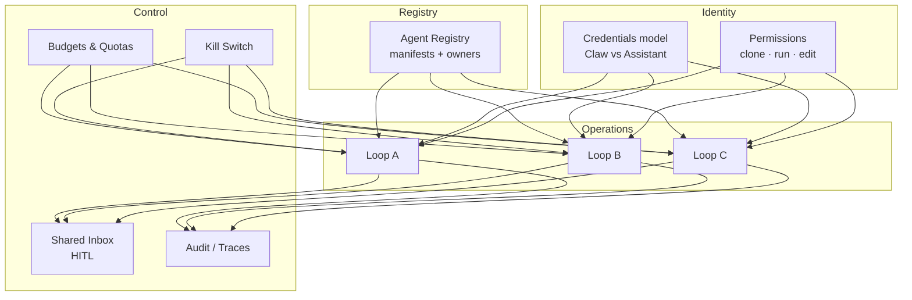
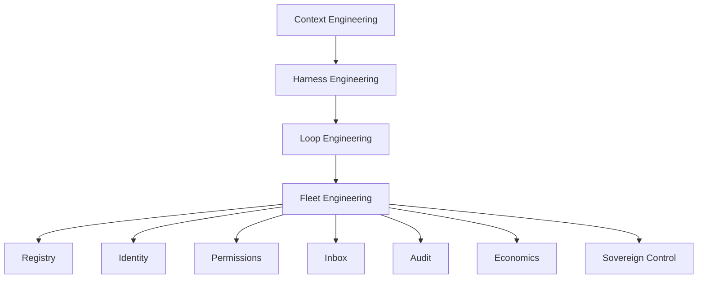
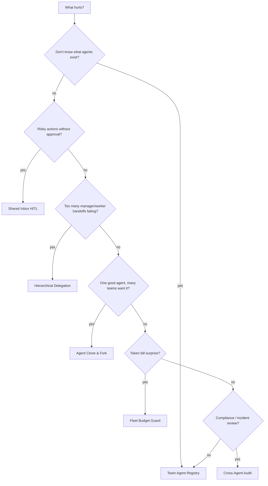
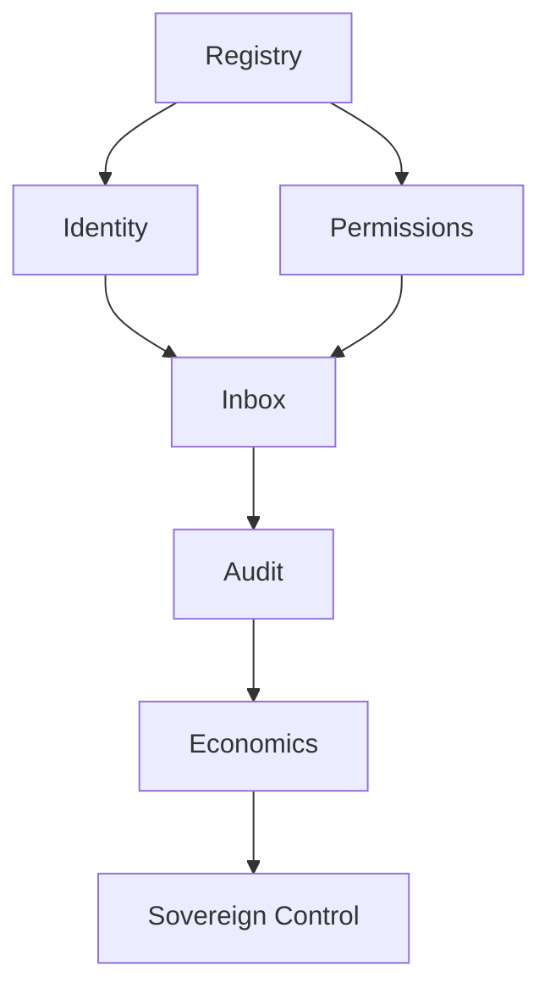
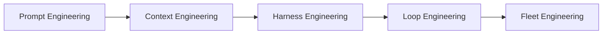

# Visuals — Mermaid Diagrams

> Mermaid diagrams from fleet-engineering markdown. Plus 2 images copied to `output/visuals/` (cobus-greyling.jpg, fleet-engineering-header.jpg).

## `README.md` — Anatomy of a Fleet (Mermaid)

## `docs/concepts.md` — Concept Map

## `docs/pattern-picker.md` — Which Fleet Pattern When?

## `docs/primitives.md` — Primitive Dependency Graph

## `docs/stack.md` — The Agent Engineering Stack

