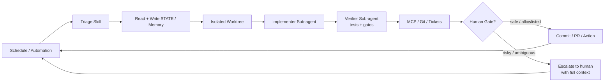
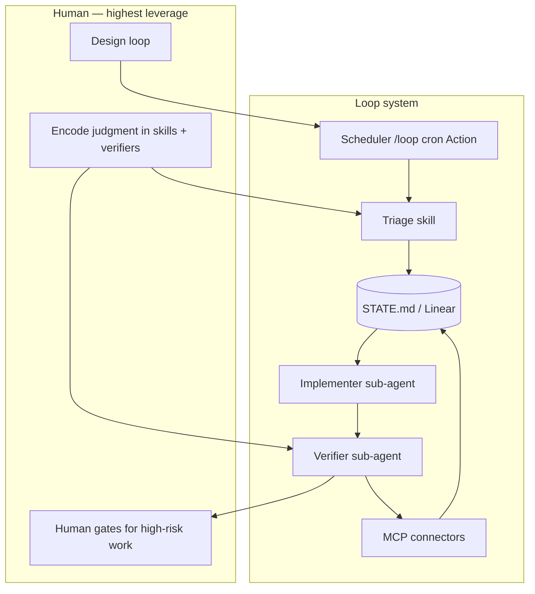
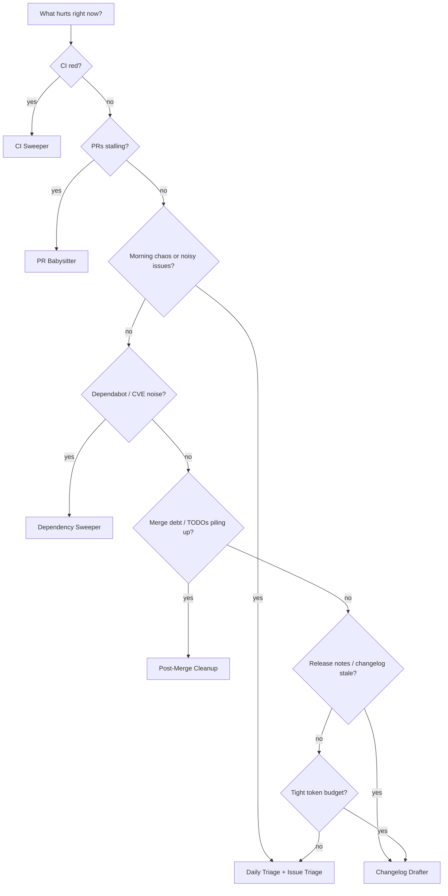

# Visuals — Mermaid Diagrams

> Mermaid from loop-engineering markdown. Plus 6 images copied to `output/visuals/`.

## `README.md` — Anatomy of a Loop (Mermaid)

## `docs/concepts.md` — Concept Map

## `docs/pattern-picker.md` — Which Pattern When?

