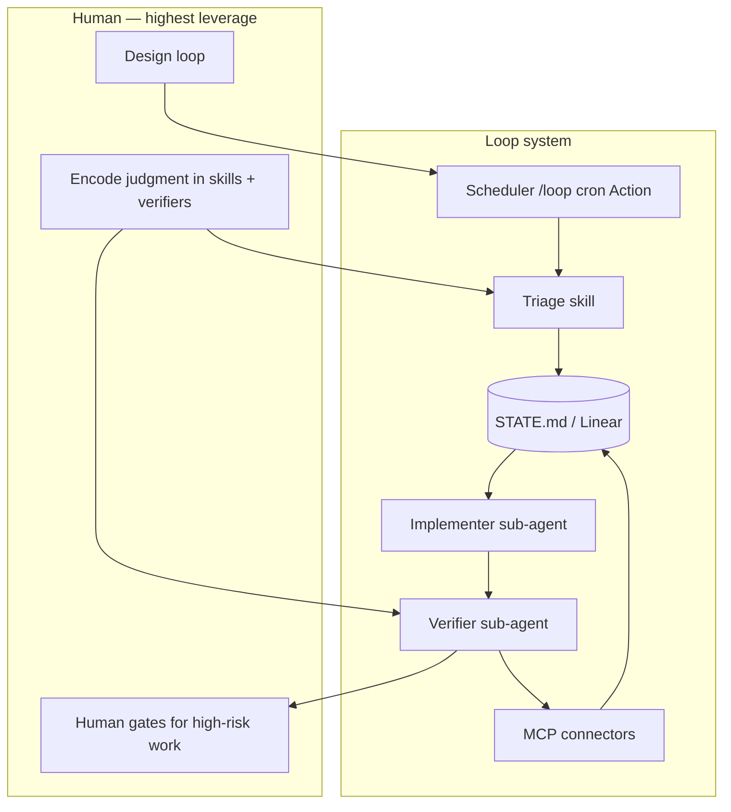

# Module 3 · Loop Engineering — Anti-Patterns & Concepts

> Source: `docs/`. High-value teaching material — anti-patterns and failure modes are the safety core. Full content preserved verbatim.
> `[THREAD: safety]` applies to anti-patterns.md and failure-modes.md.


## `docs/anti-patterns.md`

# Anti-Patterns

Design mistakes to avoid **before** enabling unattended loops. For runtime incidents, see [failure-modes.md](./failure-modes.md).

## 1. Same agent implements and verifies

**Anti-pattern**: One session marks its own work "done" after running tests once.

**Why it fails**: Confirmation bias; weak tests get rubber-stamped.

**Do instead**: Separate verifier sub-agent, model, or `/goal` checker. Verifier default stance: REJECT.

## 2. No attempt cap

**Anti-pattern**: "Keep trying until CI is green."

**Why it fails**: Infinite fix loops, token burn, merge of wrong fixes.

**Do instead**: Hard cap (e.g. 3 attempts) → escalate with full context in state file.

## 3. Vague triage output

**Anti-pattern**: Triage skill returns paragraphs of narrative.

**Why it fails**: Loop cannot parse priorities; humans ignore STATE.md.

**Do instead**: Structured markdown sections with one-line items and explicit `Suggested loop action`.

## 4. L3 before L1 quality

**Anti-pattern**: Auto-fix and auto-PR on day one.

**Why it fails**: Loop acts on bad signal; comprehension debt explodes.

**Do instead**: L1 report-only week one. Measure triage accuracy before enabling L2.

## 5. Shared state without schema

**Anti-pattern**: Three loops append to one unstructured STATE.md.

**Why it fails**: State rot, conflicting actions, ghost items.

**Do instead**: One state file per pattern, or clearly separated sections with prune rules.

## 6. MCP with write-everything scope

**Anti-pattern**: Loop can merge PRs, post to Slack, and edit production tickets on day one.

**Why it fails**: Blast radius of a bad triage decision is huge.

**Do instead**: L1 read-only connectors. Expand scope only after trust is earned.

## 7. No kill switch

**Anti-pattern**: Loop runs 24/7 with no pause criteria.

**Why it fails**: Alert fatigue, budget overrun, weekend incidents.

**Do instead**: Document pause/kill in LOOP.md + `templates/loop-budget.md.template`.

## 8. Fixing flakes with code

**Anti-pattern**: CI Sweeper changes application code when classification is `flake`.

**Why it fails**: Masks infra problems; introduces random diffs.

**Do instead**: Classify → quarantine or retry policy → escalate env/infra failures.

## 9. Auto-merge without allowlist

**Anti-pattern**: "Verifier passed, merge it."

**Why it fails**: Security and business-logic bugs pass weak verifiers.

**Do instead**: Explicit path allowlist; human merge for denylist paths per [safety.md](./safety.md).

## 10. No run log

**Anti-pattern**: Only STATE.md, no history of what the loop did.

**Why it fails**: Cannot debug "why did it do that Tuesday?"

**Do instead**: Append to `loop-run-log.md` per [operating-loops.md](./operating-loops.md).


## `docs/failure-modes.md`

# Failure Mode Catalog

Real ways loops fail — and how good design mitigates them. Use this when debugging a misbehaving loop or writing a new pattern.

## Classification

| Severity | Meaning |
|----------|---------|
| **S1 — Annoying** | Wasted time/tokens, no user harm |
| **S2 — Harmful** | Wrong code merged, bad tickets, alert fatigue |
| **S3 — Critical** | Security, data loss, production incident |

---

## Infinite Fix Loop

**Symptom**: Same PR or CI job gets automated fix attempts 5+ times; never converges.

**Severity**: S2

**Causes**:
- Verifier too weak or same session as implementer
- Root cause misdiagnosed (symptom fixing)
- Flaky test treated as regression

**Mitigations**:
- Hard cap on attempts (e.g. 3) → escalate to human
- Separate verifier model / higher reasoning effort
- Classify flakes in triage; quarantine instead of code change
- Record attempt count in state file

---

## State Rot

**Symptom**: `STATE.md` references merged PRs, closed tickets, or stale branches.

**Severity**: S1 → S2 (loop acts on ghosts)

**Causes**:
- No prune step at end of run
- State file not read at start
- Multiple loops writing same file without schema

**Mitigations**:
- Prune closed/merged items every run
- `Last run` timestamp + validate IDs against live API
- One state file per loop pattern, or clear sections

---

## Verifier Theater

**Symptom**: Verifier "approves" but tests fail in CI or review finds obvious bugs.

**Severity**: S2

**Causes**:
- Verifier prompt too vague ("looks good")
- Verifier doesn't run tests
- Same model, same context as implementer

**Mitigations**:
- Verifier must run test/lint commands and report output
- Different instructions: "find reasons to reject"
- Stronger model on verifier for unattended loops

---

## Notification Fatigue

**Symptom**: Slack/email pings every 5 minutes; team mutes the bot.

**Severity**: S1 → S2 (real escalations missed)

**Causes**:
- Notify on every run, not every *actionable* finding
- Low bar for "high priority" in triage skill

**Mitigations**:
- Notify only when human decision required
- Digest mode for report-only loops
- Tighten triage "High Priority" rules

---

## Token Burn

**Symptom**: Bill spikes; loop runs full sub-agent chains on empty or noisy triage.

**Severity**: S1

**Causes**:
- Sub-minute cadence with heavy sub-agents
- No early exit when watchlist empty
- Retrying entire pipeline on transient API errors

**Mitigations**:
- Cheaper triage-only pass first; spawn sub-agents only for actionable items
- `scheduler_delete` when nothing to watch
- Daily token budget → pause loop
- See [operating-loops.md](./operating-loops.md)

---

## Over-Reach (Wrong Scope)

**Symptom**: Loop refactors unrelated modules, "fixes" design issues, or touches denylisted paths.

**Severity**: S2 → S3

**Causes**:
- minimal-fix skill too permissive
- No path allowlist/denylist
- Triage puts architectural work in "High Priority"

**Mitigations**:
- [safety.md](./safety.md) denylist enforced in skills
- "Smallest possible diff" + verifier checks touched files
- Triage skill: signal only, no invention

---

## Comprehension Debt Spiral

**Symptom**: Velocity up, but no one can explain recent changes; review becomes rubber-stamp.

**Severity**: S2 (long-term)

**Causes**:
- Human stops reading loop output
- Auto-merge on growing allowlist
- No weekly human synthesis of loop actions

**Mitigations**:
- Mandatory human review for non-trivial PRs
- Weekly "loop digest" read by owner
- Cap auto-merge to truly trivial paths

---

## Cognitive Surrender

**Symptom**: "The loop handles it" — no opinions on correctness or design.

**Severity**: S2 (cultural)

**Causes**:
- Loop success metric = volume, not quality
- No human gates on medium-risk work

**Mitigations**:
- Explicit human gates in every pattern
- Success metric: time saved *with* quality bar held
- Osmani: "Build it like someone who intends to stay the engineer"

---

## Parallel Collision

**Symptom**: Two sub-agents edit same files; merge conflicts; corrupted state.

**Severity**: S2

**Causes**:
- No worktree isolation
- Two loops acting on same PR without coordination

**Mitigations**:
- `isolation: worktree` for all code-editing sub-agents
- Lock or queue in state: "PR #1234 — worktree in progress"

---

## Escalation Failure

**Symptom**: Loop stuck retrying; human never notified.

**Severity**: S2

**Causes**:
- Max attempts not implemented
- Escalation only writes to state no one reads

**Mitigations**:
- Connector ping on escalation (Slack, Linear comment)
- `High Priority (waiting on human)` section in STATE.md
- Alert if item in that section >24h

---

## Contributing Failures

Have a story? Add a row via PR to this doc or open an issue with:
- Pattern name
- Symptom
- What mitigated it (or didn't)


## `docs/concepts.md`

# Concepts & Vocabulary

Loop engineering sits in a family of ideas about agentic software development. This glossary links them so you can design loops with the right mental model.

## Loop Engineering

**Replacing yourself as the prompter.** You design a system that discovers work, assigns it, verifies results, and persists state — instead of typing the next prompt yourself.

A loop is a **recursive goal**: define purpose, let the agent iterate (with sub-agents and external memory) until done or until the loop escalates to a human.

## Related Concepts (Addy Osmani)

### Agent Harness Engineering

The environment **one agent** runs in: tools, context, permissions, rules. The harness is the sandbox; the loop is what **schedules and orchestrates** harness runs over time.

```
Harness = single session setup
Loop    = harness + schedule + state + verification chain
```

### The Factory Model

The system that **builds** the software: pipelines, agents, checks, and handoffs. Loop engineering is how you operate the factory floor — not manually assembling each unit.

### Intent Debt

Every session, the agent starts cold. Missing intent gets filled with confident guesses. **Skills** are how you pay down intent debt — conventions, build steps, and "we don't do it this way" written once, read every run.

### Comprehension Debt

The gap between what exists in the repo and what you actually understand. Faster loops ship more code you didn't write — comprehension debt grows unless you **read what the loop made**.

### Cognitive Surrender

The trap of letting the loop run while you stop having opinions. Designing loops with judgment is the cure; using loops to avoid thinking is the accelerant. Same action, opposite outcome.

### Orchestration Tax

The human cost of coordinating parallel agents: review bandwidth, merge conflicts, context switching. **Worktrees** remove mechanical collisions; you remain the ceiling on how many parallel loops you can absorb.

### Code Agent Orchestra / Adversarial Code Review

Structural pattern: different agents with different roles (explore, implement, verify). The implementer must never grade its own homework. Critical for **unattended** loops.

## The Six Primitives (+ Memory)

See [primitives.md](./primitives.md) and [primitives-matrix.md](./primitives-matrix.md).

1. Automations / Scheduling
2. Worktrees
3. Skills
4. Plugins & Connectors (MCP)
5. Sub-agents (maker / checker)
6. **+ Memory / State** (external, durable)

## Concept Map



## Where to Go Next

- [Loop Design Checklist](./loop-design-checklist.md) — before you ship a loop
- [Failure Modes](./failure-modes.md) — when loops go wrong
- [Operating Loops](./operating-loops.md) — cost, logging, when to pause
- [Safety](./safety.md) — guardrails for production


## `docs/loop-design-checklist.md`

# Loop Design Checklist

Use this before enabling a loop in production. Score honestly — a loop missing verification is not ready for unattended runs.

## 1. Purpose & Scope

- [ ] **Single clear goal** — one sentence: what does this loop accomplish?
- [ ] **Explicit non-goals** — what will this loop *not* do?
- [ ] **Watched scope** — which repos, branches, PRs, or tickets?
- [ ] **Phased rollout** — report-only first, then act on small wins?

## 2. Scheduling

- [ ] **Cadence chosen** — interval matches urgency (see pattern docs)
- [ ] **Fire immediately** — first run on start, or wait for interval?
- [ ] **Durable** — survives session/tool restart if needed?
- [ ] **Off-hours behavior** — slower cadence or paused overnight?
- [ ] **Self-cleanup** — `scheduler_delete` when watchlist empty?

## 3. Skills

- [ ] **Triage skill** exists with tight output format
- [ ] **Action skills** (minimal-fix, etc.) match project conventions
- [ ] **Skill descriptions** are boring and specific (good auto-triggering)
- [ ] **Build/test commands** documented in skills or AGENTS.md

## 4. Maker / Checker Split

- [ ] **Implementer** and **verifier** are separate (agent, model, or instructions)
- [ ] Implementer **cannot** mark its own work "done"
- [ ] Verifier runs **tests** in isolation (worktree) before approving
- [ ] `/goal` or equivalent uses a **fresh model** for stop condition (if applicable)

## 5. State / Memory

- [ ] **State file** or board schema documented
- [ ] Loop **reads** prior state at start of every run
- [ ] Loop **writes** outcomes, timestamps, last actions
- [ ] **Prune** resolved/merged/closed items every run
- [ ] Human overrides recorded in state

## 6. Human Handoff

- [ ] **Escalation triggers** explicit (max attempts, risk paths, ambiguity)
- [ ] **Denylist paths** — auth, payments, secrets, infra (see [safety.md](./safety.md))
- [ ] **Notification rule** — only ping human when action required
- [ ] **Inbox** — where ambiguous items land (STATE.md section, Slack, Linear)

## 7. Connectors (MCP)

- [ ] Minimum permissions for connectors (read vs write)
- [ ] Loop can **open/update PRs** or tickets if acting, not just suggest
- [ ] Bot identity clear on PR comments (e.g. "Loop Engineering — PR Babysitter")

## 8. Cost & Limits

- [ ] **Token budget** estimated (`npx @cobusgreyling/loop-cost`, [operating-loops.md](./operating-loops.md))
- [ ] **`loop-budget.md`** with daily caps and kill switch
- [ ] **`loop-run-log.md`** for append-only run history
- [ ] **`loop-budget` skill** checks spend at start/end of each run
- [ ] **Max iterations** per item per run
- [ ] **Max auto-PRs** per day (cleanup loops)
- [ ] **Pause/kill** criteria defined

## 9. Observability

- [ ] **Log each run**: started, items found, actions taken, escalations
- [ ] **Success metrics** chosen (see pattern docs)
- [ ] Team can **inspect state file** without reading chat logs

## 10. Safety

- [ ] No auto-merge without explicit allowlist
- [ ] Secrets/env files in denylist
- [ ] Flake handling — don't "fix" intermittent tests with retries alone

---

## Readiness Levels

| Level | Description | Checklist |
|-------|-------------|-----------|
| **L0 — Draft** | Documented intent only | §1 |
| **L1 — Report** | Triage → state, no auto-action | §1–3, §5 |
| **L2 — Assisted** | Small auto-fixes with verifier | §1–7 |
| **L3 — Unattended** | Runs without you watching | All sections |

Run `loop-audit` in `tools/loop-audit/` to get a numeric Loop Readiness Score for your project.

## Quick Red Flags

Stop and fix before continuing if:

- Same PR has had >3 automated fix attempts without progress
- Verifier is the same agent session as implementer
- No state file — loop has amnesia every run
- Notifications on every run regardless of findings
- Auto-merge enabled without path allowlist

